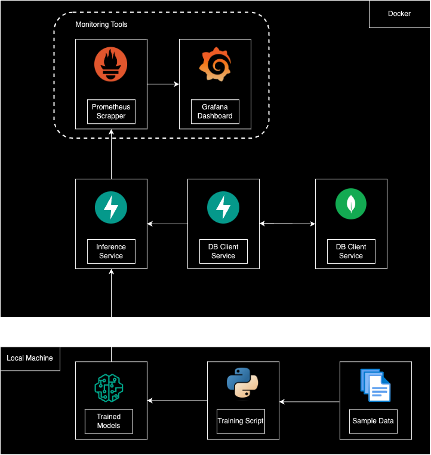

# ML Engineer Challenge 2024

## Architecture



### Proposals for improvement

- Adding a Featurstore to avoid calculating during inference.
- Replace fastapi with Robyn (Rust based, faster)
- Model Registry to manage model versions.
- CI/CD pipeline
- Save Predictions to evaluiate model performance
- Experimentation Platform for continuos model improvement.
- Deploy to a scalable platform (K8s, Fargate, etc.)
- Secret management.
- Use orchrestator (Airflow) for training jobs.
- Monitor Drifting.

## Deployment

### Requirements

- You must have docker and docker-compose installed

### Instructions

1. Open a terminal on the projects root folder and run:

```shell
docker-compose up
```
2. Wait for the images to be downloaded and built. And you are ready to go

### Application Testing

**db-client-service** - Test Via FastAPI Docs @ http://localhost:8001/docs

1. Upload CSV file. The Mongo Container is initialized empty. It is recommended to do this first.

```shell
curl -X POST "http://localhost:8001/uploadcsv/" -F "file=@[CSV_FILE_PATH};type=text/csv"
```
2. Get documents from

```shell
curl -X GET "http://localhost:8001/item_history/TEST1"
```

**price-anomaly** - Test Via FastAPI Docs @ http://localhost:8002/docs

1. Make a prediction for an item based on its price

```shell
curl -X 'POST' \
  'http://localhost:8002/anomaly' \
  -H 'accept: application/json' \
  -H 'Content-Type: application/json' \
  -d '{
  "PRICE": 30000,
  "ITEM_ID": "TEST1"
}'
```
### Additional Services

- MongoDB @ http://localhost:27017
- Prometheus @ http://localhost:9090
- Grafana @ http://localhost:3000
     - user: admin
     -password: admin

